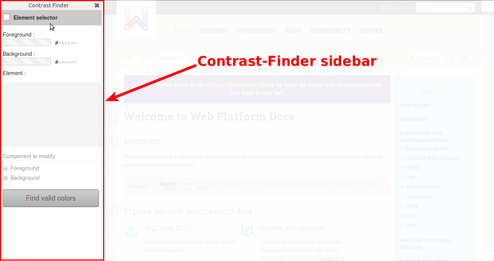
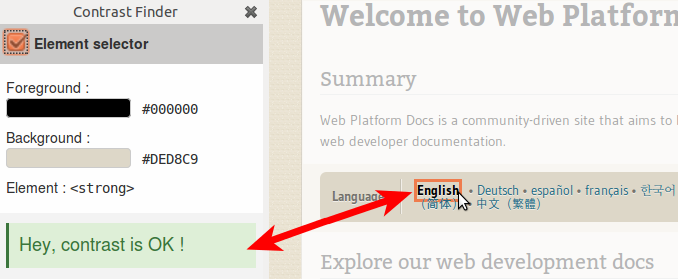
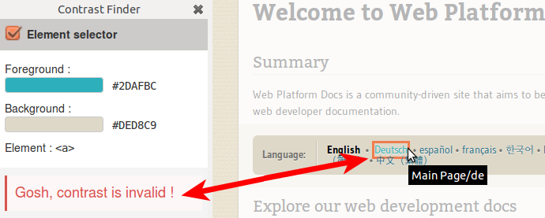
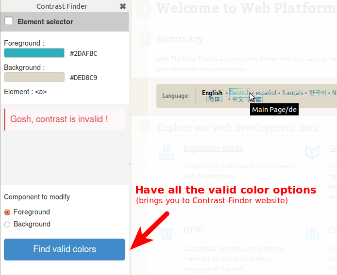
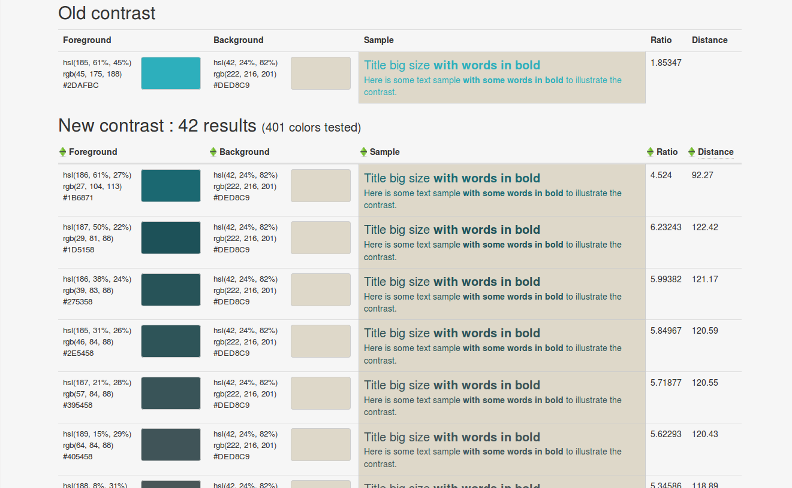

# Asqatasun Contrast-Finder-Firefox

Firefox extension to ease use of Asqatasun Contrast-Finder

This is Asqatasun **Contrast-Finder** for **Firefox**
> @@@TODO add URL of addons.mozilla.org
 
This **addon** speeds and eases the use of [Asqatasun Contrast-Finder](#) 
to find good **color contrast** by selecting **directly in the web page** 
the element whom color you want to change. 
@@@TODO update URL of Asqatasun Contrast-Finder

This helps you in satisfying web accessibility (a11y) tests on contrasts:

* [WCAG Success Criteria 1.4.3](http://www.w3.org/TR/WCAG20/#visual-audio-contrast-contrast)
* [AccessiWeb criteria 3.3](http://www.accessiweb.org/index.php/accessiweb-22-english-version.html#crit-3-3)
* [RGAA test 2.5 (in french)](http://rgaa.net/Valeur-du-rapport-de-contraste-du.html)

## Documentation
How to use ? Go to the [documentation](docs/en/) !

## Screenshots

### 1) Opening the sidebar in Firefox

### 2) Asqatasun Contrast-Finder's sidebar

### 3) Activate Element selector

### 4) while hovering any element, contrast is automatically computed. This one is good.

### 5) This text's contrast is not sufficient. Let's click to select it.

### 6) Choose which color to modify (foreground / background), and click the button "Find valid colors".

This makes Contrast-Finder computing possible colors and by the way brings you to Contrast-Finder website
.

### 7) Contrast-Finder offers a set of valid colors for contrast

### Keyboard usage

Focus to a given text, then press the "context menu" key, choose which color (background / foregound) to modify.

